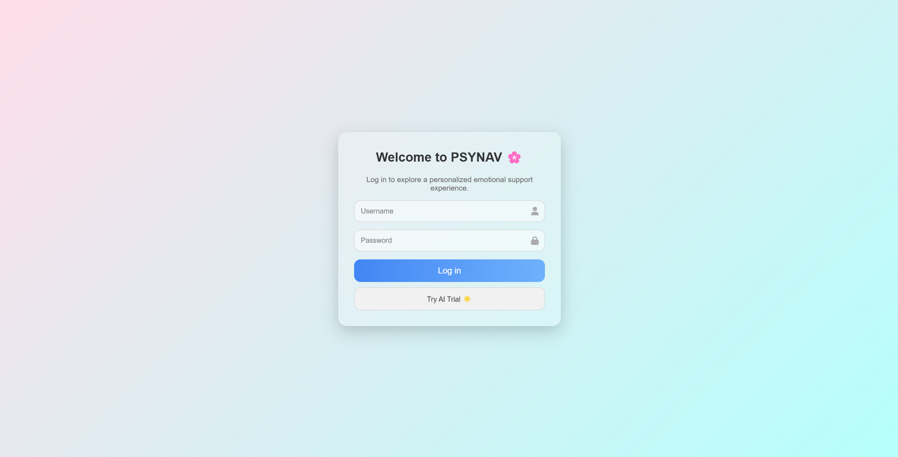
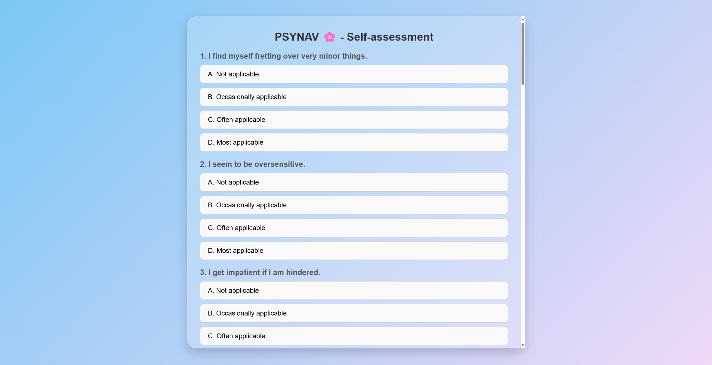
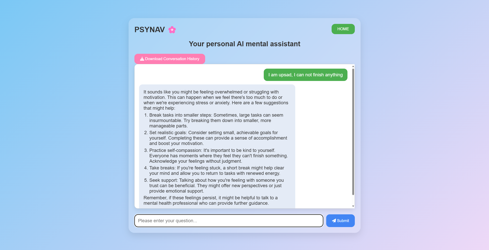

# PSYNAV: Exploring User Needs and Expectations and Designing AI Psychological Assistants  

## Introduction  
**PSYNAV** is a research-driven project that explores how AI can be designed to support psychological well-being.  
By combining **self-assessment tools**, **personalized AI assistance**, and **user-centered design principles**, PSYNAV aims to provide a safe, accessible, and effective platform for psychological support.  
#### ✒️ **Authors**

[**Jiashuo Chang**](https://github.com/SJHPCJS), **Zimo Lei**

This work has been **accepted by [the 2025 IEEE 7th International Conference on Artificial Intelligence, Computer Science and Information Processing (AICSIP 2025), Hangzhou, China](https://www.aicsconf.cn/)**.  

---

## Features  
- 🧩 **Login System** – Secure entry for users to access their personalized space.  
- 📊 **Self-Assessment Module** – Interactive questionnaires to evaluate mood, stress, and psychological states.  
- 🤖 **AI Assistance** – Conversational AI support providing guidance, coping strategies, and emotional reflection.  
- 🎨 **User-Centered Design** – Interfaces designed based on real user needs and feedback.  

---

## Screenshots  

**Login Interface**  
  

**Self-Assessment**  
  

**AI Assistance**  
  

---

## Research Background  
This project is based on our study *“Exploring User Needs and Expectation and Designing AI Psychological Assistants”*, which analyzes:  
- User trust and privacy concerns in AI-driven mental health systems.  
- Preferred interaction styles for AI in sensitive contexts.  
- Design recommendations for balancing automation and human oversight.  


---

## Publication  
This paper has been **accepted for publication** at:  

**2025 IEEE 7th International Conference on Artificial Intelligence, Computer Science and Information Processing (AICSIP 2025)**  
- Date: **July 25th–27th, 2025**  
- Location: **Hangzhou, China**  
- Status: **Accepted to proceedings, EI indexed**  

---

## Citation  
If you find PSYNAV useful in your research, please cite:  

```bibtex
@inproceedings{PSYNAV2025,
  title={PSYNAV: Exploring User Needs and Expectation and Designing AI Psychological Assistants},
  author={Chang, Jiashuo and Lei, Zimo},
  booktitle={Proceedings of the 2025 IEEE 7th International Conference on Artificial Intelligence, Computer Science and Information Processing (AICSIP)},
  year={2025},
  address={Hangzhou, China},
  note={Accepted for publication}
}

